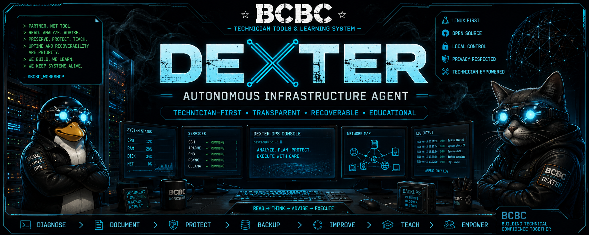

# BCBC Autonomous Infrastructure Agent — Dexter

## Overview

The BCBC Autonomous Infrastructure Agent project is an early-stage experiment focused on building a technician-first AI operations assistant for real-world Linux infrastructure, home lab environments, educational systems, diagnostics, and long-term maintainability.

This is not intended to be a “magic AGI” project.

The goal is to create a practical, transparent, safety-oriented AI assistant capable of helping manage infrastructure responsibly while teaching users how systems actually work.

## Core Philosophy

The objective is not blind automation.

The objective is:

- Recoverability
- Transparency
- Safety
- Maintainability
- Education
- Staged operations
- Operational clarity

The AI agent is intended to function more like:

> a careful infrastructure operations partner

rather than:

> an opaque autonomous replacement for human judgment

## Example Dexter Agent Session

A local Ollama model was prompted with operational philosophy and infrastructure conventions rather than generic autonomous AI hype language.

The model began shifting from generic chatbot behavior toward:

> infrastructure operations reasoning

The interaction demonstrated that operational philosophy and environment conventions dramatically influence the usefulness and maturity of local AI infrastructure assistants.

## Infrastructure Environment

Current environments and experiments include:

- Debian Linux systems
- Apache-hosted tools and dashboards
- SMB network shares
- rsync-based backup workflows
- Ollama local models
- Local AI agent experimentation
- Technician learning systems
- Linux command reference tooling
- AI-assisted educational concepts
- GitHub Pages educational projects

## Naming and Workflow Conventions

The BCBC environment strongly favors self-documenting systems.

Directory naming example:

    YYYY-MM-DD-description

Example:

    2026-05-15-fastdata-backup

Project organization should separate:

- Production
- Staging
- Experimental
- Backups
- Logs
- Exports
- Documentation

## Important Design Principles

This project intentionally avoids:

- Unnecessary hype
- Fake AGI claims
- Blind destructive automation
- Hidden operational logic
- Overcomplicated abstractions

The system should always:

- Explain reasoning
- Preserve recoverability
- Prioritize data safety
- Encourage learning
- Help future technicians understand the environment

- ## Day One Prompt Log

This repository includes the very first saved local interaction used to begin shaping Baxter into a technician-first autonomous infrastructure assistant.

The session captures the early operational philosophy, workflow direction, naming conventions, and infrastructure mindset that became the foundation for the project.

Read the original interaction here:

[Day One — Very First Prompt](https://github.com/WJFranza/baxter-autonomous-agent/blob/main/day-one-very-first-prompt.txt)

## Related Projects

### BCBC Git & GitHub Guide

https://wjfranza.github.io/bcbc-git-guide/

### Linux Admin Cheat Sheet System

Modular Linux command reference and technician learning platform with import/export concepts and reusable command packs.

### BCBC AI Checker

A mobile-first AI image and clip awareness/education project focused on AI-generated media understanding and practical detection concepts.

## Infrastructure Support

Special thank you to **ClouDNS** for supporting reliable DNS infrastructure for BCBC projects.

ClouDNS support helps strengthen the infrastructure story behind this work, including public project hosting, DNS reliability, experimentation, and educational demonstrations around real-world networking and technician workflows.

https://www.cloudns.net/

## Credits

BCBC Technician Tools and Learning System

Built and designed by:

- William J Franza
- Mikey_LikesIT
- ChatGPT-assisted development and collaboration

---

## Infrastructure Support

Special thank you to **ClouDNS** for supporting reliable DNS infrastructure for BCBC projects.

ClouDNS support helps strengthen the infrastructure story behind this work, including public project hosting, DNS reliability, experimentation, and educational demonstrations around real-world networking and technician workflows.

https://www.cloudns.net/

---

## Credits

BCBC Technician Tools and Learning System

Built and designed by:

- William J Franza
- Mikey_LikesIT
- ChatGPT-assisted development and collaboration

Infrastructure support and inspiration:

- ClouDNS
- Open-source Linux ecosystem
- Technician and sysadmin communities

---

## Project Status

Early-stage active development and experimentation.

This repository currently represents:

- Operational philosophy
- Infrastructure concepts
- AI interaction experiments
- Workflow structure
- Autonomous assistant direction
- Technician-first design patterns

The project is expected to evolve significantly over time.

## Infrastructure Support

Special thank you to **ClouDNS** for supporting reliable DNS infrastructure for BCBC projects.

---
